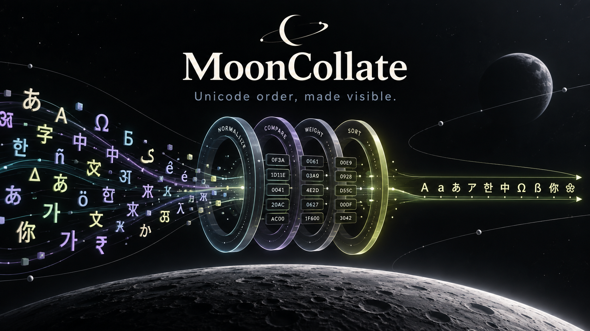
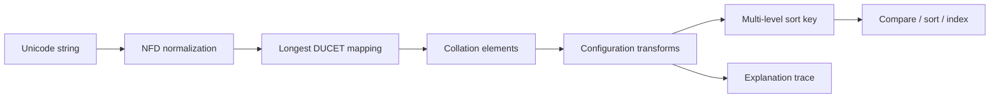

# MoonCollate



<p align="center">
  <strong>A portable Unicode collation foundation for MoonBit.</strong><br>
  Compare, sort, index, and explain multilingual text with one deterministic API.
</p>

<p align="center">
  <a href="https://github.com/CaptainK-65/moon-collate/releases/tag/v0.2.0"></a>
  <a href="https://github.com/CaptainK-65/moon-collate/actions/workflows/ci.yml"></a>
  <a href="https://www.unicode.org/reports/tr10/"></a>
  <a href="https://github.com/CaptainK-65/moon-collate/blob/main/LICENSE"></a>
  <a href="https://captaink-65.github.io/moon-collate/"></a>
</p>

MoonCollate is a pure MoonBit implementation of the [Unicode Collation
Algorithm](https://www.unicode.org/reports/tr10/) (UCA), backed by the Unicode
17.0.0 Default Unicode Collation Element Table (DUCET). It provides reusable
collation primitives for search engines, tables, databases, indexes, developer
tools, and internationalized applications without depending on an operating
system locale or `Intl.Collator`.

> **Try it now:** [Collation Lab](https://captaink-65.github.io/moon-collate/)
> visualizes normalization, collation elements, sort-key levels, and the exact
> weight that decides a comparison.

## Why MoonCollate?

Unicode code-point order is deterministic, but it is not human text order.
Accents, case, punctuation, canonical equivalence, contractions, and expansions
all affect how text should compare. Implementing those rules separately in every
MoonBit application is difficult to audit and easy to get wrong.

MoonCollate fills that ecosystem gap with one portable foundation:

- **Reusable infrastructure** — a library API, not an application-specific sort
  routine.
- **Standards-based behavior** — generated from pinned Unicode 17.0.0 data and
  validated against official Unicode conformance fixtures.
- **Backend consistency** — the same core runs on `native`, `js`, `wasm`, and
  `wasm-gc`.
- **Explainable decisions** — structured traces expose normalization, DUCET
  mappings, weights, sort keys, and the first differing level.
- **Reproducible data** — MoonBit generators rebuild the committed tables from
  vendored, checksummed upstream inputs.

## Features

| Capability | What it provides |
| --- | --- |
| Unicode collation | DUCET singletons, expansions, contractions, discontiguous contractions, and implicit weights |
| Comparison strengths | Primary, secondary, tertiary, quaternary, and identical |
| Configuration | Non-ignorable/shifted alternate handling, case-first, backwards secondary, and numeric mode |
| Sort keys | Deterministic, reusable multi-level keys with hexadecimal diagnostics |
| Collection tools | Stable sort, equality grouping, deduplication, min/max, and sortedness checks |
| Repeated lookup | Immutable `CollationIndex` with cached keys and binary-search operations |
| Diagnostics | `explain`, `compare_detailed`, JSON-ready reports, and decision-level differences |
| Interfaces | MoonBit library, native CLI, and browser-based Collation Lab |

## Quick start

### Add the package

```sh
moon add CaptainK-65/moon-collate@0.2.0
```

### Build from source

Install a current [MoonBit toolchain](https://www.moonbitlang.com/download/),
then clone and validate the project:

```sh
git clone https://github.com/CaptainK-65/moon-collate.git
cd moon-collate
moon update
moon check --target all
moon test --target all
```

### Compare and sort

```moonbit
let collator = @moon_collate.default_collator()
let order = collator.compare("resume", "résumé")

let natural = collator.with_numeric(true)
let files = natural.sort(["file10", "file2", "file1"])
// ["file1", "file2", "file10"]
```

### Choose comparison semantics

```moonbit
let search_collator = @moon_collate.default_collator()
  .with_strength(@moon_collate.Strength::Primary)
  .with_alternate(@moon_collate.AlternateHandling::Shifted)

let same_base_text = search_collator.equivalent("coop", "co-op")
```

### Build a reusable index

```moonbit
let collator = @moon_collate.default_collator()
  .with_strength(@moon_collate.Strength::Primary)

let index = @moon_collate.CollationIndex::new(
  collator,
  ["Zulu", "é", "E", "apple"],
)

let contains_e = index.contains("e")
let matches = index.equal_range("e")
let match_count = index.count_equal("e")
let window = index.range("e", "Zulu") // half-open [e, Zulu)
```

See the [user guide](docs/guide.md) for complete configuration and operational
guidance. The package-facing, compiler-checked examples remain in
[`README.mbt.md`](README.mbt.md).

## Command-line interface

The CLI mirrors the library's core behavior and emits structured JSON for key
and explanation commands:

```sh
moon run cmd/main -- compare resume résumé
moon run cmd/main -- key --strength secondary café
moon run cmd/main -- explain --shifted "co-op"
moon run cmd/main -- sort --numeric file10 file2 file1
```

## How it works



The browser Lab and native CLI are thin adapters over the same root package;
they do not contain independent collation implementations.

## Conformance and verification

The v0.2.0 release candidate is validated against both the committed Unicode
17.0.0 SHORT fixtures and the downloaded, checksum-pinned FULL fixtures:

| Validation target | Result |
| --- | ---: |
| Non-ignorable FULL profile | **208,039 adjacent pairs, 0 failures** |
| Shifted FULL profile | **229,829 adjacent pairs, 0 failures** |
| Focused automated tests | **54 per portable backend; 58 native, 0 failures** |
| MoonBit backends | **native, js, wasm, wasm-gc passed** |
| Coverage audit | **16 uncovered executable lines** |

CI also protects compare/key equivalence, canonical equivalence, collection
stability, numeric ordering, diagnostics, CLI behavior, and the browser model.
Exact claims, fixture scope, and upstream hashes are recorded in the
[conformance statement](docs/conformance.md). See the
[release evidence](docs/release-evidence-v0.2.0.md) and
[performance notes](docs/performance.md) for the reproducible terminal gates.

## Scope

MoonCollate v0.2.0 implements the default Unicode 17.0.0 collation profile. It
is deliberately a focused collation foundation; it is **not**:

- a full ICU or CLDR locale-tailoring replacement;
- a database, search engine, or text-shaping system;
- an operating-system locale wrapper;
- a promise that sort keys remain byte-compatible across library or Unicode
  versions.

Applications should persist source strings and record the library, Unicode,
UCA, and collator configuration alongside any stored keys. Read the
[limitations](docs/limitations.md) and [ecosystem overlap audit](docs/ecosystem-audit.md)
before adopting the library for locale-specific behavior.

## Project structure

```text
moon-collate/
├── collator.mbt            # comparison, key generation, and traces
├── config.mbt              # immutable collator configuration
├── collections.mbt         # sorting, grouping, and CollationIndex
├── normalization.mbt       # canonical decomposition and ordering
├── generated_*.mbt         # reproducible Unicode lookup data
├── cmd/                    # CLI and conformance runners
├── playground/             # MoonBit-backed browser Collation Lab
├── tools/                  # MoonBit data generators (.mbtx)
├── third_party/unicode/    # pinned upstream data and license
└── docs/                   # guides, design, scope, and evidence
```

Generated Unicode tables are reviewed and committed for deterministic builds,
but are kept separate from hand-written implementation code.

## Documentation

- [User guide](docs/guide.md) — strengths, configuration, collections, indexes,
  and operational rules
- [Algorithm notes](docs/algorithm.md) — UCA processing and implementation
  decisions
- [Architecture](docs/architecture.md) — package boundaries and invariants
- [Conformance](docs/conformance.md) — test profiles, results, and hashes
- [Performance](docs/performance.md) — allocation changes and measurement rules
- [v0.2.0 release evidence](docs/release-evidence-v0.2.0.md) — traceable gates
- [Limitations](docs/limitations.md) — explicit boundaries and non-goals
- [Changelog](CHANGELOG.md) — release history
- [Security policy](SECURITY.md) — vulnerability reporting

## Development

```sh
moon update
moon fmt --check
moon check --target all
moon test --target all
moon run --target native cmd/conformance
moon run --target native cmd/conformance -- --shifted
moon run --target native cmd/conformance -- --full
moon run --target native cmd/conformance -- --full --shifted
moon info
```

Contributions are welcome. Please read [CONTRIBUTING.md](CONTRIBUTING.md) before
opening an issue or pull request. Release work and completed engineering tasks
are tracked in the repository's [Issues](https://github.com/CaptainK-65/moon-collate/issues),
[Actions](https://github.com/CaptainK-65/moon-collate/actions), and
[Releases](https://github.com/CaptainK-65/moon-collate/releases).

## 中文简介

MoonCollate 是一个面向 MoonBit 生态的通用 Unicode 排序基础库。它将
Unicode 17.0.0 UCA/DUCET 的规范能力封装为可复用 API，可用于搜索、表格、
数据库索引、开发者工具和国际化应用；同一套核心代码可运行于 native、JS、
Wasm 与 wasm-gc 后端。项目同时提供命令行工具和可视化 Collation Lab，便于
理解每次比较背后的规范化过程、排序权重与决策层级。

本项目聚焦“通用生态库”定位，不实现具体业务产品，也不将浏览器界面作为第二套
算法实现。所有 Unicode 数据均固定版本、可追溯、可重新生成，并通过官方一致性
语料与多后端测试验证。

## License

MoonCollate is available under the [Apache License 2.0](LICENSE). Vendored
Unicode data remains subject to the Unicode License v3; see
[`THIRD_PARTY_NOTICES.md`](THIRD_PARTY_NOTICES.md).
